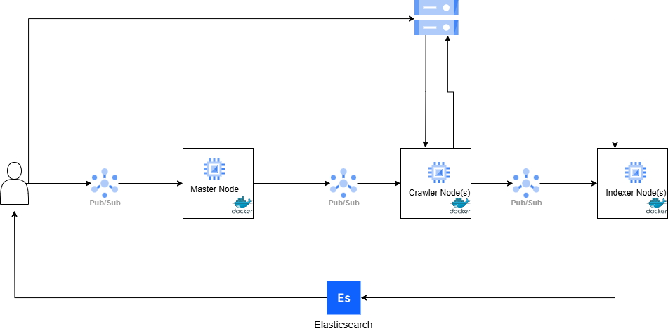

# Distributed Web Crawling and Indexing System on GCP


## Overview

This distributed system crawls web pages, processes their content, and indexes them using Elasticsearch running on Google Cloud Platform (GCP). It provides a scalable architecture for web data collection, processing, and searching with a user-friendly interface.

## Features

- **New Crawl**: Submit new crawling tasks with configurable depth and domain restrictions
- **Search URLs**: Search through crawled URLs with advanced filtering options
- **Full-Text Search**: Powerful full-text search capabilities for indexed content
- **Export Index Data**: View and export the indexed data from Elasticsearch in various formats
- **Real-Time Monitoring**: Track the progress of crawling and indexing tasks in real-time
- **System Health Dashboard**: Monitor the health and performance of all system components
- **Scalable Architecture**: Easily scale components to handle larger workloads
- **Domain Restrictions**: Limit crawling to specific domains or exclude unwanted domains
- **Customizable Indexing**: Configure how content is processed and indexed

## System Architecture



The system consists of the following components:

1. **UI Layer**:

   - Flask web application for user interaction
   - RESTful API endpoints for programmatic access
   - Real-time dashboard using WebSockets

2. **Control Layer**:

   - **Master Node**: Coordinates crawling tasks and manages worker allocation
   - **Task Scheduler**: Prioritizes and distributes crawling tasks
   - **Metrics Collector**: Aggregates system performance metrics

3. **Processing Layer**:

   - **Crawler Nodes**: Distributed crawlers that fetch and process web pages
   - **Content Extractor**: Parses HTML and extracts relevant content
   - **Indexer Nodes**: Prepares and indexes processed content

4. **Storage Layer**:

   - **Elasticsearch**: For indexing and searching content
   - **Cloud Storage**: For storing raw crawl data and processed content

5. **GCP Services**:
   - **Pub/Sub**: For asynchronous message passing between components
   - **Cloud Functions**: For event-driven processing
   - **Cloud Run**: For containerized service deployment
   - **Monitoring & Logging**: For system observability

## Setup Instructions

### Prerequisites

- Google Cloud Platform account with billing enabled
- Elasticsearch managed service on GCP or Elastic Cloud
- Python 3.8+
- Docker and Docker Compose (for containerized deployment)
- Git (for cloning the repository)

### Initial Setup

1. Clone the repository:

   ```bash
   git clone https://github.com/yourusername/Distributed-Web-Crawling-and-Indexing-System-GCP.git
   cd Distributed-Web-Crawling-and-Indexing-System-GCP
   ```

2. Set up GCP resources:

   ```bash
   # Authenticate with GCP
   gcloud auth login

   # Set your project ID
   gcloud config set project your-project-id

   # Create a Cloud Storage bucket
   gsutil mb gs://your-storage-bucket

   # Create Pub/Sub topics and subscriptions
   gcloud pubsub topics create new-crawl-jobs
   gcloud pubsub topics create crawl-metrics
   gcloud pubsub topics create crawl-progress
   gcloud pubsub subscriptions create metrics-subscription --topic=crawl-metrics
   gcloud pubsub subscriptions create progress-subscription --topic=crawl-progress
   ```

3. Set up Elasticsearch:
   - Create an Elasticsearch cluster on GCP or Elastic Cloud
   - Note the endpoint, port, username, and password

### Environment Configuration

Create a `.env` file in the root directory with the following variables:

```bash
# GCP Configuration
GCP_PROJECT_ID=your-project-id
GCS_BUCKET_NAME=your-storage-bucket

# Pub/Sub Configuration
NEW_CRAWL_JOB_TOPIC_ID=new-crawl-jobs
CRAWL_METRICS_TOPIC_ID=crawl-metrics
CRAWL_PROGRESS_TOPIC_ID=crawl-progress
METRICS_SUBSCRIPTION_ID=metrics-subscription
PROGRESS_SUBSCRIPTION_ID=progress-subscription

# Elasticsearch Configuration
ES_HOST=your-elasticsearch-host
ES_PORT=9243
ES_USERNAME=your-es-username
ES_PASSWORD=your-es-password
ES_INDEX_NAME=web_content
ES_USE_SSL=true

# UI Configuration
FLASK_SECRET_KEY=your-secret-key
FLASK_DEBUG=false
FLASK_HOST=0.0.0.0
FLASK_PORT=5000

# Crawler Configuration
MAX_WORKERS=10
DEFAULT_CRAWL_DEPTH=3
REQUEST_TIMEOUT=30
RESPECT_ROBOTS_TXT=true
USER_AGENT=DistributedWebCrawler/1.0
```

### Running the Components

#### Option 1: Running Locally

1. Set up a Python virtual environment:

   ```bash
   python -m venv venv
   source venv/bin/activate  # On Windows: venv\Scripts\activate
   pip install -r requirements.txt
   ```

2. Run the UI:

   ```bash
   cd src/UI
   python main.py
   ```

3. Run the Master node:

   ```bash
   cd src/master
   python master_node.py
   ```

4. Run Crawler nodes:

   ```bash
   cd src/crawler
   python crawler_node.py
   ```

5. Run Indexer nodes:

   ```bash
   cd src/indexer
   python indexer_node.py
   ```

#### Option 2: Using Docker Compose

```bash
# Build and start all services
docker-compose up -d

# Access the UI at http://localhost:5000
```

## Using the System

### Starting a New Crawl

1. Go to the "New Crawl" tab
2. Enter seed URLs (one per line)
3. Set the crawl depth (how many links to follow from each page)
4. Configure domain restrictions:
   - **Allow List**: Only crawl these domains (e.g., `example.com,example.org`)
   - **Deny List**: Never crawl these domains (e.g., `ads.example.com`)
5. Set additional options:
   - **Max URLs**: Maximum number of URLs to crawl
   - **Respect robots.txt**: Toggle to honor robots exclusion protocol
   - **Crawl frequency**: How often to revisit already crawled pages
6. Click "Start Crawling"

### Searching Indexed Content

1. Go to the "Search Index" tab
2. Enter keywords to search
3. Apply filters:
   - **Domain filter**: Limit results to specific domains
   - **Date range**: Filter by crawl date
   - **Content type**: Filter by MIME type (HTML, PDF, etc.)
4. Select sorting options:
   - **Relevance**: Default sorting by search relevance
   - **Date**: Sort by crawl date (newest/oldest)
   - **Domain**: Sort alphabetically by domain
5. Click "Search"
6. View results with highlighted matching terms

### Exporting Indexed Data

1. Go to the "Export Data" tab
2. Select export format (JSON, CSV, Excel)
3. Choose what data to include:
   - **Full content**: Include all indexed content
   - **URLs only**: Only export URLs
   - **Metadata**: Export URLs with metadata (title, description, etc.)
4. Set export limits and filters
5. Click "Generate Export"
6. Download the generated file

### Monitoring Progress

1. Go to the "Dashboard" tab
2. View real-time metrics:
   - **Crawl Rate**: URLs crawled per minute
   - **Index Rate**: Documents indexed per minute
   - **Queue Size**: Number of URLs waiting to be crawled
   - **Error Rate**: Percentage of failed requests
3. Check component health status
4. View detailed logs for troubleshooting

## Deployment

### GCP Deployment

This system is designed to run on Google Cloud Platform using various managed services:

1. **Set up Infrastructure as Code**:

   ```bash
   # Deploy using Terraform
   cd terraform
   terraform init
   terraform apply
   ```

2. **Deploy Containers to Cloud Run**:

   ```bash
   # Build and push containers to Google Container Registry
   gcloud builds submit --tag gcr.io/your-project-id/web-crawler-ui ./src/UI
   gcloud builds submit --tag gcr.io/your-project-id/web-crawler-master ./src/master
   gcloud builds submit --tag gcr.io/your-project-id/web-crawler-crawler ./src/crawler
   gcloud builds submit --tag gcr.io/your-project-id/web-crawler-indexer ./src/indexer

   # Deploy to Cloud Run
   gcloud run deploy web-crawler-ui --image gcr.io/your-project-id/web-crawler-ui --platform managed
   gcloud run deploy web-crawler-master --image gcr.io/your-project-id/web-crawler-master --platform managed
   # Deploy crawler and indexer similarly
   ```

3. **Set up Autoscaling**:

   ```bash
   # Configure autoscaling for crawler nodes
   gcloud run services update web-crawler-crawler --min-instances=2 --max-instances=20
   ```

## Customization

### Elasticsearch Configuration

Edit the Elasticsearch index mapping in `src/indexer/indexer_node.py` to modify how content is indexed:

```python
INDEX_MAPPING = {
    "mappings": {
        "properties": {
            "url": {"type": "keyword"},
            "title": {"type": "text", "analyzer": "english"},
            "content": {"type": "text", "analyzer": "english"},
            "domain": {"type": "keyword"},
            "crawl_date": {"type": "date"},
            # Add custom fields here
        }
    }
}
```

### UI Customization

- Modify the UI templates in `src/UI/templates/` to change the user interface
- Update CSS styles in `src/UI/static/css/`
- Add custom JavaScript in `src/UI/static/js/`

### Crawler Configuration

Edit `src/crawler/crawler_config.py` to customize crawler behavior:

```python
# Example configuration options
DEFAULT_USER_AGENT = "YourCustomBot/1.0"
MAX_RETRIES = 3
CONNECTION_TIMEOUT = 30
FOLLOW_REDIRECTS = True
```

## Contributing

Contributions are welcome! Please feel free to submit a Pull Request.

1. Fork the repository
2. Create your feature branch (`git checkout -b feature/amazing-feature`)
3. Commit your changes (`git commit -m 'Add some amazing feature'`)
4. Push to the branch (`git push origin feature/amazing-feature`)
5. Open a Pull Request

## Acknowledgments

- Google Cloud Platform for providing the infrastructure
- Elasticsearch for powerful search capabilities
